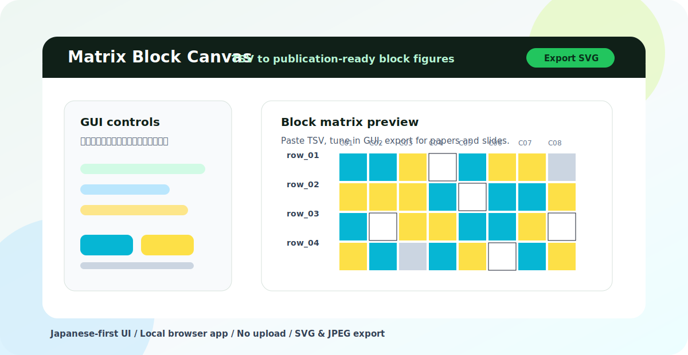

<p align="center">
  
</p>

<h1 align="center">Matrix Block Canvas</h1>

<p align="center">
  日本語UIで、TSVから発表・論文向けのブロック行列図を作るブラウザツール。<br>
  A Japanese-first browser GUI for turning TSV or categorical matrices into clean block figures.
</p>

<p align="center">
  <a href="LICENSE"></a>
  
  
  
</p>

---

## 日本語

### 何ができる？

Matrix Block Canvas は、TSV やカテゴリ行列から、見栄えのするブロック図を作るための
GUIツールです。PowerPointやExcelでセルを塗って整える作業を、ブラウザ上で完結させる
ことを目指しています。

表を貼り付けて、色、ラベル、注釈、領域、凡例を画面で調整し、SVGまたはJPEGとして
書き出せます。グラフィカル遺伝子型風の図にも使えますが、特定の生物種やデータセット
には依存していません。

通常利用ではデータを外部サーバーへ送信しません。一部の設定や作業中データは、同じ端末
のブラウザlocalStorageに保存される場合があります。

### こんな場面に

- PowerPointで手作業していたブロック図を、もう少し楽に作りたい
- 発表スライドや論文用に、カテゴリ行列をきれいに見せたい
- RやPythonを書くほどではないが、図の色やラベルは細かく調整したい
- 遺伝子型風のABH/カテゴリ行列、品質フラグ、状態一覧をまとめたい
- 日本語UIで研究室メンバーにも使いやすいツールがほしい

### 基本の流れ

1. TSVを貼り付ける、またはブラウザ上で行を作る
2. GUIで色、ラベル、注釈、表示範囲を整える
3. SVG/JPEGで書き出して、スライドや原稿に貼る

### 入力例

```tsv
sample	c01	c02	c03
group	1	1	2
pos	1	2	3
row_01	A	A	B
row_02	B	B	B
row_03	A	H	B
row_04	B	A	-
```

値はカテゴリとして扱われ、色に対応づけられます。Flapjack風の MAP + GENOTYPE テキスト
も読み込めます。

### 主な機能

| 機能 | 内容 |
| --- | --- |
| GUI編集 | 色、ラベル、注釈、領域、凡例、オーバーレイを画面上で調整 |
| TSV入力 | 表計算ソフトやテキストから貼り付けて図に変換 |
| 手動ビルダー | ブラウザ上で行や値を作成 |
| Flapjack風入力 | MAP + GENOTYPE 形式のテキストを読み込み |
| 書き出し | SVG / JPEG に対応 |
| ローカル実行 | 通常利用では外部サーバーへデータ送信なし |

### 開発

```powershell
npm install
npm run dev
```

通常は次のようなローカルURLで開きます。

```text
http://127.0.0.1:5174/
```

### ビルド

```powershell
npm run typecheck
npm run build
```

### クレジット

アイデア、方向性、ユースケース設計:

- light-suzuki

コード実装は、OpenAI Codex と GPT-5.5 / GPT-5.4 系モデル、および関連するcoding
modelの支援を受けて進めました。

このような小さく実用的な研究支援ツールを作れる開発体験を提供してくれたCodexチームと
Codexの作成者に感謝します。

### 引用

研究・論文・発表で使った場合は、このリポジトリを引用してもらえると嬉しいです。
`CITATION.cff` を含めているため、GitHub上で「Cite this repository」が表示されます。

### ライセンス

MIT Licenseです。ライセンス条件に従う限り、利用、コピー、改変、公開、配布、
サブライセンス、販売が可能です。

---

## English

### What Is This?

Matrix Block Canvas is a browser-based GUI tool for turning TSV or categorical
matrices into clean block figures for slides, reports, and papers.

It is meant for the kind of figure that often ends up being drawn by hand in
PowerPoint, Excel, Illustrator, or one-off scripts. Paste a matrix, tune the
appearance in the GUI, and export a ready-to-use SVG or JPEG.

The current UI is Japanese-first. The app runs in your browser and does not
upload your data during normal use. Some settings and draft workspace data may
be saved in your browser's local storage on the same device.

### Good For

- Genotype-style block figures.
- Row-by-column categorical heatmaps.
- Quality flag or status matrices.
- Compact comparison figures for lab meetings, posters, and papers.
- Researchers who want GUI editing without manually drawing every cell.

### Workflow

1. Paste TSV data or build rows in the browser.
2. Adjust colors, labels, annotations, regions, and legends in the GUI.
3. Export SVG/JPEG and use the figure in slides or manuscripts.

### Input Example

```tsv
sample	c01	c02	c03
group	1	1	2
pos	1	2	3
row_01	A	A	B
row_02	B	B	B
row_03	A	H	B
row_04	B	A	-
```

Values are treated as categories and mapped to colors. Flapjack-like MAP +
GENOTYPE text is also supported.

### Features

| Feature | Description |
| --- | --- |
| GUI editing | Tune colors, labels, annotations, regions, legends, and overlays |
| TSV input | Paste tables from spreadsheets or text files |
| Manual builder | Create rows and values directly in the browser |
| Flapjack-like input | Import MAP + GENOTYPE text |
| Export | SVG and JPEG |
| Local-first | No data upload during normal use |

### Development

```powershell
npm install
npm run dev
```

Open the local URL shown by Vite, usually:

```text
http://127.0.0.1:5174/
```

### Build

```powershell
npm run typecheck
npm run build
```

### Credits

Project idea, direction, and use-case design:

- light-suzuki

Code implementation was developed with AI assistance from OpenAI Codex using
GPT-5.5 / GPT-5.4-family models and related coding models during the extraction
and public-release preparation process.

Special thanks to the Codex team and the creators of Codex for making this kind
of small, practical research-tool development workflow possible.

### Citation

If you use Matrix Block Canvas in academic work, please cite this repository.
The repository includes `CITATION.cff`, so GitHub should show a "Cite this
repository" option.

### License

MIT License. You may use, copy, modify, publish, distribute, sublicense, and/or
sell copies of the software, subject to the license terms.
