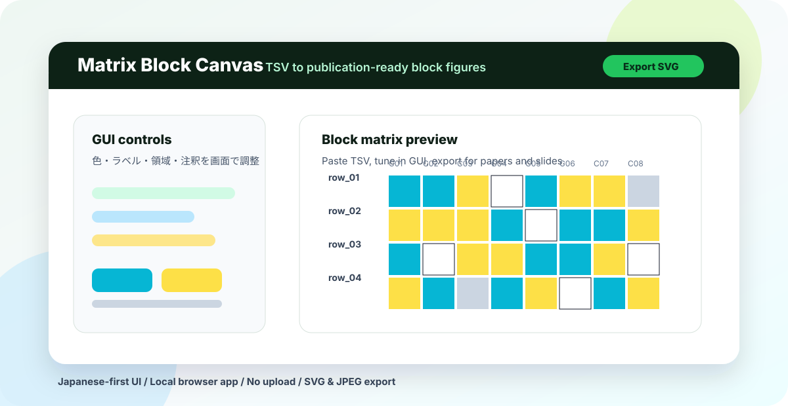

<p align="center">
  
</p>

<h1 align="center">Matrix Block Canvas</h1>

[](https://github.com/light-suzuki/matrix-block-canvas/actions/workflows/ci.yml)
[](https://light-suzuki.github.io/matrix-block-canvas/)
[](LICENSE)

<p align="center">
  日本語UIで、TSVやカテゴリ行列から発表・論文向けのブロック図を作るブラウザツール。<br>
  Windowsでは、開発環境なしで持ち運べる単一HTML版も生成できます。
</p>

---

## まず使う

### 1. インストール不要: Web版

GitHub Pagesでそのまま使えます。

https://light-suzuki.github.io/matrix-block-canvas/

通常の編集処理はブラウザ内で行われ、入力した行列データをアプリのサーバーへ送信する仕組みはありません。

### 2. 別のWindows PCへ持っていく: 単一HTML版

このリポジトリは、Viteの本番ビルドからJS/CSSを1ファイルにまとめた
`MatrixBlockCanvas-portable.html` を生成できます。

```powershell
npm ci
npm run portable
```

生成物:

```text
dist\MatrixBlockCanvas-portable.html
```

このHTMLファイルだけをUSBメモリ、共有フォルダ、クラウドストレージ等で別PCへコピーし、
Edge / Chrome / Firefoxで開けます。配布先PCにはNode.jsやnpmは不要です。

GitHub Pagesのデプロイでも同じportable HTMLを生成するため、mainへの反映後は次のURLからも開けます。

https://light-suzuki.github.io/matrix-block-canvas/MatrixBlockCanvas-portable.html

portable版ではビルド時に外部Webフォントの `@import` を除去し、ローカルのJS/CSSファイルへ依存しないことを検査します。
フォントはWindows/ブラウザのシステムフォントへフォールバックします。

### 3. ソースからWindows PCへセットアップ: ダブルクリック

リポジトリをcloneまたはZIP展開した後、ルートにある次のファイルを実行します。

```text
SETUP_WINDOWS.cmd
```

このスクリプトは次を自動実行します。

1. 対応Node.js（20.19–20.x または 22.12+）があるか確認
2. なければ `winget` で現在のNode.js LTSをインストール
3. `npm ci` でlockfileどおりに依存関係を再現
4. TypeScript typecheck
5. Vite production build
6. portable単一HTMLを生成
7. portable HTMLを既定ブラウザで開く

一度セットアップ済みなら `RUN_WINDOWS.cmd` でportable版を開けます。

> Windows上では、プロジェクトのフォルダ名または親パスに `&` を含めないでください。
> npm/ViteのWindows command shimで問題になることがあるため、セットアップスクリプトでも検出して停止します。

---

## はじめて使う人へ — まずはここだけ

コードを触らなくても、普通の図作成はできます。
人からこのツールを渡された場合は、まず次の流れだけ覚えれば十分です。

1. Web版、または `MatrixBlockCanvas-portable.html` を開く
2. 入力方法を選ぶ
   - **Builder**: 画面上で手作業で作る
   - **TSV**: Excelなどから表を貼り付ける
   - **Flapjack**: MAP + GENOTYPE形式を使う
3. 図を生成する
4. 必要なら **Palette** や **Theme** を変える
5. ラベル、行間、図の幅などを調整する
6. **Export** を開き、SVGまたはJPEGで保存する

迷った場合は、まず **Builder** を開いて既存の例を触ってみるのが簡単です。
色や見た目を変えても元のTSVデータそのものが書き換わるわけではありません。

### どこを触れば何が変わる？

| やりたいこと | 主に触る場所 | 難しさ |
| --- | --- | --- |
| A/B/Hの色を変える | `Palette` | かんたん |
| 背景を明るく/暗くする | `Theme` | かんたん |
| A/B/H/欠測を手で直す | `Builder` | かんたん |
| TSVを貼って図にする | `TSV` | かんたん |
| 行名や注釈を変える | `Builder` のラベル・注釈欄 | かんたん |
| 図の横幅を変える | `Builder` のサイズ設定 | かんたん |
| 行の高さ・行間を変える | `Builder` のサイズ設定 | かんたん |
| 左右のラベル領域を広げる | annotation / label領域の幅設定 | ふつう |
| 線・矢印・文字・四角を追加する | Builderのオブジェクト編集 | ふつう |
| マーカー軸やガイド表示を変える | Builder / TSVの表示設定 | ふつう |
| 凡例や細かな線幅・文字色まで変える | `Advanced` | 少し上級 |
| 新しい色セットを常設する | `src/ggtTemplates.ts` | コード編集 |
| 新しい斜線・ドット模様を作る | `src/GraphicalGenotypeSvg.tsx` | コード編集 |

---

## 何ができる？

Matrix Block Canvasは、TSVやカテゴリ行列から、見栄えのするブロック図を作るGUIツールです。
PowerPointやExcelでセルを手作業で塗って整える作業を、ブラウザ上で完結させることを目指しています。

表を貼り付けて、色、ラベル、注釈、領域、凡例を画面で調整し、SVGまたはJPEGとして書き出せます。
グラフィカル遺伝子型風の図にも使えますが、特定の生物種やデータセットには依存していません。

### 主な機能

| 機能 | 内容 |
| --- | --- |
| GUI編集 | 色、ラベル、注釈、領域、凡例、オーバーレイを画面上で調整 |
| TSV入力 | 表計算ソフトやテキストから貼り付けて図に変換 |
| 手動ビルダー | ブラウザ上で行や値を作成 |
| Flapjack風入力 | MAP + GENOTYPE形式のテキストを読み込み |
| 書き出し | SVG / JPEG |
| ローカル処理 | 通常の図作成処理はブラウザ内で完結 |
| Windows portable | JS/CSS込みの単一HTMLを生成し、Nodeなしの別PCへコピー可能 |
| 再現性 | `package-lock.json` + `npm ci`、Linux/Windows CIで検証 |

### TSV入力例

```tsv
sample	c01	c02	c03
group	1	1	2
pos	1	2	3
row_01	A	A	B
row_02	B	B	B
row_03	A	H	B
row_04	B	A	-
```

基本的には、1行目が列名、1列目がサンプル名です。

- `A`, `B`, `H` はカテゴリとして色分けされます
- `-` は欠測として扱われます
- `group` は染色体・グループなどのまとまりを示す行として使えます
- `pos` は位置情報として使えます

Excelからコピーした表をTSV欄へ貼り付けても構いません。

---

## 見た目を変える

### 色を変える — まずはPaletteを選ぶ

通常はコードを触る必要はありません。
Builder / TSV / Flapjackなどにある **Palette** のプルダウンから色セットを選べます。

現在は例えば次のプリセットがあります。

- `Cyan/Yellow/White`
- `Blue/Green/Red`
- `Okabe-Ito`
- `Blue/Yellow/White`
- `Grayscale Patterns`
- `High Contrast B/W`

論文用に色覚多様性を意識する場合は `Okabe-Ito`、白黒印刷なら `Grayscale Patterns` や `High Contrast B/W` が使えます。

### 背景を変える

**Theme** で `Dark` / `Light` を切り替えられます。

「画面の見た目」だけでなく、生成する図の背景との相性もあるので、
発表スライドならDark、論文図ならLightなど、用途に合わせて選んでください。

### 図の大きさを変える

Builderでは、図の横幅、セルの大きさ、行の高さ、行間、ラベル・注釈用領域の幅などを調整できます。

目安としては次のように考えると簡単です。

- **図が横に詰まりすぎる** → Canvas widthを大きくする
- **1マスが細かすぎる** → Cell sizeを大きくする
- **行同士が窮屈** → Row height / Row gapを大きくする
- **サンプル名や注釈が切れる** → Annotation widthを大きくする

最初から完璧な数値にする必要はありません。プレビューを見ながら少しずつ変えるのが安全です。

### ラベル・注釈を変える

Builderではサンプル名、右側ラベル、注釈、図タイトルなどを編集できます。
図中の文字をクリックして編集できる項目もあります。

「データ本体」と「表示用の名前」は分けて考えると扱いやすいです。
例えばサンプルIDは元データのまま残し、図に表示するラベルだけ短くする、といった使い方ができます。

### 線・矢印・文字・四角を追加する

Builderのオブジェクト編集では、図の上に次のような要素を重ねられます。

- Text
- Rectangle
- Line
- Arrow

特定の候補領域を囲む、重要なマーカーへ矢印を付ける、説明文字を追加する、といった用途を想定しています。

### SVGとJPEGはどちらを使う？

- **SVG**: 論文、Illustrator/Inkscapeでの仕上げ、拡大して使う場合におすすめ
- **JPEG**: PowerPointへの貼り付け、確認用画像、手軽に共有したい場合に便利

迷ったらSVGを保存しておくと後から編集しやすいです。

---

## もっと細かく変えたい場合 — Advanced

`Advanced` タブでは、現在の描画設定をJSONとして直接編集できます。

ここでは、GUIに出していない細かな値まで変更できます。例えば次のような項目です。

```json
{
  "width": 1600,
  "height": 900,
  "background": "#ffffff",
  "plot": {
    "annotationWidth": 320,
    "rowHeight": 40,
    "rowGap": 10
  },
  "styles": {
    "text": {
      "fontSize": 16,
      "fill": "#111827"
    },
    "segment": {
      "stroke": "#111827",
      "strokeWidth": 1.2
    }
  }
}
```

主な意味:

| 項目 | 意味 |
| --- | --- |
| `width` / `height` | 図全体の大きさ |
| `background` | 背景色 |
| `plot.annotationWidth` | ラベル・注釈領域の幅 |
| `plot.rowHeight` | 各行の高さ |
| `plot.rowGap` | 行と行の間隔 |
| `styles.text.fontSize` | 基本文字サイズ |
| `styles.text.fill` | 基本文字色 |
| `styles.segment.stroke` | ブロックの枠線色 |
| `styles.segment.strokeWidth` | ブロックの枠線幅 |
| `legend` | 凡例の位置・文字・色など |
| `overlays` | 追加した文字、四角、線、矢印など |

JSONの文法を壊すと反映できませんが、不正なJSONを入力しただけで現在の描画を即座に消す仕様にはしていません。
よく分からない場合はAdvancedを触らなくても通常利用には問題ありません。

---

## コードを少し触ってカスタマイズする

ここから先は、アプリそのものを改造したい人向けです。
普通に図を作るだけなら読む必要はありません。

### 新しい色セットを追加する

色プリセットは次のファイルにまとまっています。

```text
src/ggtTemplates.ts
```

この中の `palettePresets` に1項目追加すると、Paletteのプルダウンにも表示されます。

例:

```ts
{
  id: "red_blue_white",
  name: "Red/Blue/White",
  description: "A=red / B=blue / H=white / missing=gray",
  colors: {
    A: "#d73027",
    B: "#4575b4",
    H: "#ffffff",
    "-": "#d1d5db",
    other: "#999999"
  },
  legend: [
    { label: "A", fill: "#d73027" },
    { label: "B", fill: "#4575b4" },
    { label: "H", fill: "#ffffff", stroke: "#111827", strokeWidth: 1 },
    { label: "Missing", fill: "#d1d5db" }
  ]
},
```

`#d73027` のような値は一般的なHEXカラーです。
Web上のカラーピッカーなどで好みの色を選び、その値をコピーすれば変更できます。

変更したら次を実行して壊れていないか確認してください。

```powershell
npm run check
```

### 色ではなく斜線・ドットなどの模様を追加する

既存の `Grayscale Patterns` はSVGのpattern機能を使っています。
模様そのものは主に次のファイルで定義しています。

```text
src/GraphicalGenotypeSvg.tsx
```

既存例では、次のようなIDがあります。

```text
ggt-pat-line-a
ggt-pat-line-b
ggt-pat-dot-h
```

パレット側では例えば次のように指定します。

```ts
fill: "url(#ggt-pat-line-a)"
```

**色だけ変えたい場合はここまで触る必要はありません。**
新しい斜線、クロスハッチ、ドット模様を本当に追加したい場合だけ `GraphicalGenotypeSvg.tsx` の `<pattern>` 定義を編集してください。

### アプリ画面そのものの見た目を変える

「出力する図」ではなく、ボタンやサイドバーなど**アプリのUI自体**を変える場合は主に次のファイルです。

```text
src/workbench.css
src/styles.css
```

機能や画面構成そのものは主に:

```text
src/App.tsx
```

SVG図の描画方法は主に:

```text
src/GraphicalGenotypeSvg.tsx
```

SVG/JPEGの保存処理は:

```text
src/exportImage.ts
```

という分担です。

### どのファイルを触ればいいか分からない場合

| 変更したいこと | 最初に見るファイル |
| --- | --- |
| 色プリセット | `src/ggtTemplates.ts` |
| 図のテンプレート | `src/ggtTemplates.ts` |
| SVGの模様・描画方式 | `src/GraphicalGenotypeSvg.tsx` |
| ボタン・入力欄・機能 | `src/App.tsx` |
| アプリ画面のCSS | `src/workbench.css`, `src/styles.css` |
| SVG/JPEG書き出し | `src/exportImage.ts` |
| portable HTML生成 | `scripts/make-portable.mjs` |

`package-lock.json` や `.github/workflows/` は、色や図の見た目を変えるだけなら通常触る必要はありません。

---

## Windowsでの開発

### 必要環境

- Windows 10 / 11
- Node.js 20.19–20.x または 22.12+（現在のLTS推奨）
- npm
- Edge / Chrome / Firefoxの現行版

Vite 8のNode.js要件に合わせています。

### cloneして起動

```powershell
git clone https://github.com/light-suzuki/matrix-block-canvas.git
cd matrix-block-canvas
npm ci
npm run dev
```

Viteが表示するローカルURLを開いてください。既定では通常 `http://127.0.0.1:5173/` です。
5173番ポートが使用中の場合は別ポートになることがあります。

LAN内の別端末から開発サーバーへ接続したい場合だけ、次を使います。

```powershell
npm run dev:lan
```

Windows Firewallの許可が必要になる場合があります。通常利用では `npm run dev` を推奨します。

### 変更後の確認

コードを変更した後は、まず次を実行してください。

```powershell
npm run check
```

`check` は以下をまとめて実行します。

- `npm run typecheck`
- `npm run build`
- portable単一HTML生成と埋め込み検査

GitHub ActionsではUbuntuとWindowsの両方で同じ検証を実行し、high以上の既知npm依存脆弱性がないことも検査します。

### 個別コマンド

```powershell
npm run typecheck
npm run build
npm run portable
npm run preview
```

---

## PC間で引き継がれるもの / 引き継がれないもの

portable HTMLそのものは1ファイルで移動できます。一方、ブラウザの `localStorage` に保存された作業中設定は
ブラウザ・端末ごとの保存領域なので、HTMLファイルをコピーしただけでは別PCへ移りません。

TSVなどの元データ、書き出したSVG/JPEGは通常のファイルとして移動できます。
重要な作業については元TSVと出力ファイルを別途保存してください。

---

## 困ったとき

### 図がおかしくなった

まず入力したTSVの列数が各行でそろっているか確認してください。
特にExcelから貼り付けた場合、末尾に空列が付いていないかを見ると原因を見つけやすいです。

### 文字やラベルが切れる

図の横幅、Annotation width、Row heightなどを少し大きくしてください。

### 色が見づらい

まずPaletteを変更してください。
白黒印刷では `Grayscale Patterns` または `High Contrast B/W` が使えます。

### PowerPointなどで後から細かく直したい

JPEGではなくSVGで書き出してください。
SVGならベクター図としてIllustratorやInkscapeなどで後編集しやすくなります。

### 別PCに持っていったら前回の作業状態がない

これは正常です。
作業途中の設定はブラウザの `localStorage` に保存されるため、portable HTMLだけコピーしても別PCへは移りません。
元TSVや書き出した図は別ファイルとして保存してください。

### コードを変更したら起動しなくなった

まず次を実行してください。

```powershell
npm run check
```

エラーが出た場合は、そのエラーメッセージと変更したファイルを確認してください。
見た目を変えただけの場合は、変更箇所を一度元に戻すと切り分けしやすくなります。

---

## CI / 配布

- `.github/workflows/ci.yml`: Ubuntu + Windowsで `npm ci`、high以上のnpm audit、`npm run check`
- `.github/workflows/pages.yml`: GitHub Pages用ビルドとportable HTML生成
- Pages workflowでは `MatrixBlockCanvas-portable.html` もworkflow artifactとして保存

これにより、開発PC固有の `node_modules` や絶対パスを持ち込まず、別Windows PCでも同じlockfileから再現できます。

---

## クレジット

アイデア、方向性、ユースケース設計:

- light-suzuki

コード実装はOpenAI CodexおよびGPT系coding modelの支援を受けて進めました。

## 引用

研究・論文・発表で使った場合は、このリポジトリを引用してもらえると嬉しいです。
`CITATION.cff` を含めているため、GitHub上で「Cite this repository」が利用できます。

## ライセンス

MIT Licenseです。ライセンス条件に従う限り、利用、コピー、改変、公開、配布、
サブライセンス、販売が可能です。

---

## English quick start

Matrix Block Canvas is a Japanese-first browser GUI for turning TSV or categorical matrices into clean block figures.

- Online app: https://light-suzuki.github.io/matrix-block-canvas/
- Windows/source setup: double-click `SETUP_WINDOWS.cmd`
- Development: `npm ci` then `npm run dev`
- Validation: `npm run check`
- Portable build: `npm run portable`
- Portable output: `dist\MatrixBlockCanvas-portable.html`

For ordinary use, no code editing is required. Use Builder, TSV, or Flapjack input, choose a Palette and Theme, adjust labels/layout, then export as SVG or JPEG.

Color presets live in `src/ggtTemplates.ts` under `palettePresets`. SVG pattern definitions live in `src/GraphicalGenotypeSvg.tsx`. Application layout/styles are mainly in `src/App.tsx`, `src/workbench.css`, and `src/styles.css`.

The portable file contains the built JavaScript and CSS and can be copied to another Windows PC and opened in a modern browser without Node.js. Remote CSS font imports are removed from the portable build so startup does not require network access.

Draft settings stored in browser `localStorage` are device/browser-local and are not transferred merely by copying the portable HTML file.
